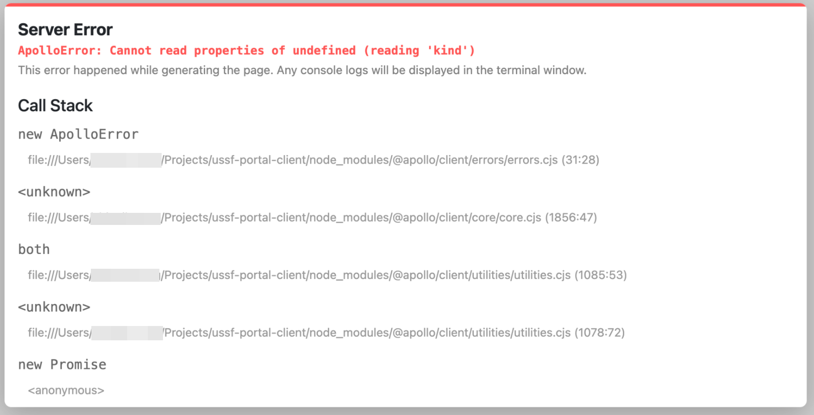

# Troubleshooting

## ApolloError: Cannot read properties of undefined (reading 'kind')

This error typically results after switching branches due to new migrations that no longer exist or vice versa. The current solution is to reset the database and containers.



### 1. Remove running containers

> :warning: The commands below assume you are in the `ussf-portal-client` repo

Remove all running containers, you can use `yarn services:removeall` or any of the docker commands for stopping and removing containers. 

```sh
yarn services:removeall
```

### 2. Remove all images

You will want to ensure docker has enough space by removing all images

```sh
docker system prune --all
```

### 3. Remove volumes to reset your database data

Finally you should reset the databases by dropping the data volumes.

> :warning: Volumes are *NOT* removed in the above `docker system prune` command.

```sh
docker volume ls --quiet | xargs docker volume rm
```

It might be enough to run steps 1. and 3. but last time I ran into this I also had to run 2. to get past everything.
