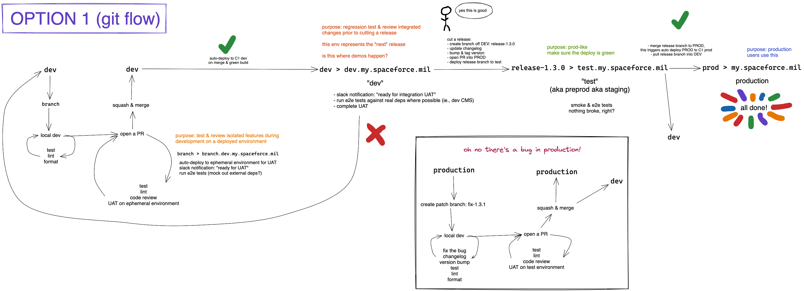
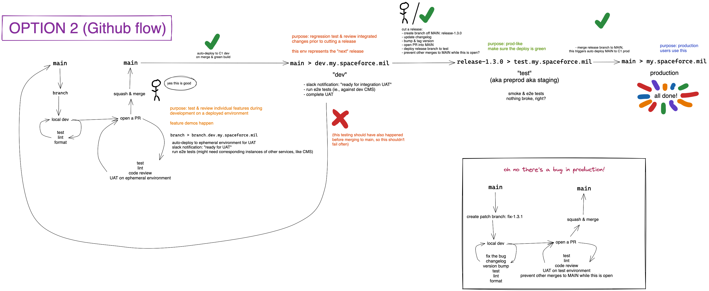

# Use GitHub flow for releasing the application code

- Status: Accepted
- Deciders: @suzubara @abbyoung @esacteksab @noahfirth
- Date: 2021-07-21

## Context and Problem Statement

We should agree on a workflow for developing, testing, and releasing code in order to have a consistent developer experience and project-wide understanding of how code is released.

## Decision Drivers

- It's important to us to maintain some version number that is easy to communicate and represents the code at a given point in time.
- We want to automate as much of the development -> production pipeline as possible, with the exception of a single manual gate we can use to determine whether a set of changes should go to production.

## Considered Options

- Use the model known as [Git-flow](https://nvie.com/posts/a-successful-git-branching-model/)
- Use the model known as [GitHub flow](https://guides.github.com/introduction/flow/)

## Decision Outcome

Use the model known as [GitHub flow](https://guides.github.com/introduction/flow/). After some discussion, we have decided on this option for the following reasons:

- We have a preference towards continuous deployment, and would like to choose the workflow that best encourages automation, high test coverage, and smaller, more frequent releases.
- Because our team size is small, and because our `main` branch settings require branches be up-to-date before merging, the risk of merging multiple conflicting changes simultaneously is very low (if not zero).
- Also because our team size is small, the overhead of managing two long-lived branches is more of a burden than if we had more resources.
- Neither flow precludes assigning version numbers to each release, which can be useful for tracking changes and debugging production when needed.
- If desired at some point in the future, it is easier to transition from the simpler GitHub workflow to the more complex git-flow than the other way around.

See below for full details & pros and cons of each.

## Pros and Cons of the Options <!-- optional -->

See the diagrams for an illustration of the two options. Both options also assume the following:

- We will use [semantic versioning](https://semver.org/) for tagging each version of the code that is deployed to the production environment. The main reasons for this are:
  - The USSF portal client codebase is a NodeJS app, which uses the `package.json` file to indicate its version, and expects the version format to use semver.
  - Many tools available for automating version bumps & changelog generation assume semver.
  - While this project doesn't necessarily require adherence to the semver standard, it is also not incompatible with it.
- We will use Github branch protection and Github actions to automate as much of the workflow as possible.
- We can deploy feature branches to ephemeral environments for UAT before work is merged to a main branch.
- We have three environments: **dev, test, production**

### [Git-flow](https://nvie.com/posts/a-successful-git-branching-model/)

The primary differentiator of Git-flow is that it uses _two_ "main" branches. In the article linked above, they're referred to as `master` and `develop` -- for our purposes, we will call them `dev` and `prod` (production). The `prod` branch always represents the code as it is on the production environment, and is always "deployable". The `dev` branch represents the "next" release of the code while it is in active development, and it is always safe to merge new work to.

The advantages of this flow generally support larger teams with many moving parts, needing to account for multiple workstreams simultaneously, and explicitly manage what goes into a release.

#### Example workflow:

- Engineer starts a branch `feature-a` off `dev`, work is completed and passes required checks
  - Engineer opens a PR into `dev`, which triggers an automatic deployment to an ephemeral environment **feature-a.dev**
  - Complete UAT of the feature on the ephemeral environment
- Branch `feature-a` is merged into `dev`
  - Merges to `dev` trigger an automatic deployment to the **dev** environment
  - Integration UAT and E2E tests are run, and new work is demo'd to the team
- If the changes are approved, an engineer will run the release script on their local machine on the `dev` branch:
  - Update the changelog and bump the version number
  - Commit those changes to a new release branch called `release-x.x.x`
  - Open a PR of `release-x.x.x` into the `prod` branch
  - Trigger an automatic deployment of the release branch to the **test** environment
- If the deployment above succeds, the release PR is merged into the `prod` branch
  - The release branch changes need to be pulled back into the `dev` branch
  - Trigger an automatic deployment of the `prod` branch to the **production** environment

#### Patch workflow:

- Someone reports an urgent bug on the **production** environment
- Engineer starts a branch `fix-x.x.y` off `prod`, work is completed and passes required checks
  - Engineer opens a PR into `prod`, which triggers an automatic deployment to the **test** environment
  - Complete UAT of the fix on the **test** environment
- The fix PR is merged into the `prod` branch, which triggers an automatic deployment to the **production** environment
  - The fix branch changes need to be pulled back into the `dev` branch

#### Pros:

- The `prod` branch can be used as a base for urgent patches if a bug is discovered in the production environment, without having to worry about what has been introduced to the `dev` branch since the last release.
- The `dev` branch allows for an inflection point between feature development and production, where multiple features can be merged and tested alongside each other before committing them to a production release.

#### Cons:

- Managing two main branches is more work than managing one.
- We need to determine a mechanism for keeping `dev` and `prod` in-sync with release changes and patches. This can be a challenge to automate given the branch protection rules we have in place (i.e., requiring a PR approval).

### [GitHub flow](https://guides.github.com/introduction/flow/)

The primary differentiator of Github flow is that it uses a single "main" branch (called `main`), which should both be always safe to deploy to production, and always safe to merge new work to.

It generally supports a simpler, more implicit workflow, where features are continuously developed, tested, merged, and released in a single stream, with as much automation as possible and less overhead of managing branches and releases, which can be more advantageous on a smaller team.

This flow operates well with the branch protection setting that requires branches be up-to-date before they can be merged, which should mitigate the risk that incompatible features are released. It also benefits from high automated test coverage.

#### Example workflow:

- Engineer starts a branch `feature-a` off `main`, work is completed and passes required checks
  - Engineer opens a PR into `main`, which triggers an automatic deployment to an ephemeral environment **feature-a.dev**
  - Complete UAT of the feature on the ephemeral environment
  - This branch is kept up-to-date with the `main` branches before it can be merged
  - The feature is demo'd to the team, and feedback is addressed on the branch
- Branch `feature-a` is merged into `main`
  - Merges to `main` trigger an automatic deployment to the **dev** environment
  - Integration UAT and E2E tests are run
- The release script runs on the `main` branch (this could be automated in Github actions):
  - Update the changelog and bump the version number
  - Commit those changes to a new release branch called `release-x.x.x`
  - Open a PR of `release-x.x.x` into the `main` branch
  - Trigger an automatic deployment of the release branch to the **test** environment
- If the deployment above succeds, the release PR is merged into the `main` branch
  - Trigger an automatic deployment of the `main` branch to the **production** environment

#### Patch workflow:

- Someone reports an urgent bug on the **production** environment
- Engineer starts a branch `fix-x.x.y` off `main`, work is completed and passes required checks
  - Engineer opens a PR into `main`, which triggers an automatic deployment to the **test** environment
  - Complete UAT of the fix on the **test** environment
- The fix PR is merged into the `main` branch, which triggers an automatic deployment to the **production** environment

#### Pros

- Managing one main branch is simpler and has less overhead than managing two.
- Removes the need to keep release & patch changes in sync.

#### Cons

- The team needs to keep awareness of what is being merged to avoid incompatible changes ending up on the `main` branch. It is more important that the `main` branch builds stay green.
- It is important to ensure no unrelated changes are merged to the `main` branch if a `release-` or `fix-` PR is open (which tends to be short-lived). This can be achieved with a Github action.

## Links

- [Git-flow](https://nvie.com/posts/a-successful-git-branching-model/)
- [GitHub flow](https://guides.github.com/introduction/flow/)
