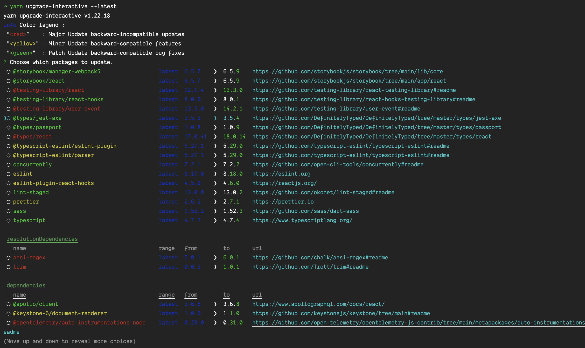

# JS/Node dependency management

This document describes methodology & tips for keeping our JS dependencies up-to-date. It assumes we are using `yarn` over `npm`.

Using an automated tool such as Dependabot or Renovatebot can help streamline updates, but there is _no_ substitute for having a reasonable understanding of what our dependencies are, and why we have them.

## Dependency resolution & lockfile

First of all, it's useful to know the syntax of the `package.json` and `yarn.lock` files. Understanding how to read these can be extremely helpful when trying to determine what version of a dependency is being installed, and to debug potential issues.

### Version locking

You will notice that all of the packages listed are set to specific versions (instead of a range using the `^` or `~` characters). This is to help ensure that installing dependencies is deterministic -- i.e., running `yarn install` will always resolve to the same versions on any environment -- and it also means we are in full control of all version updates.

### `dependencies`

Packages that are actively required & used by the application _while it is running in production mode_. It is easy to mistakenly add development packages here since it is the default when running `yarn add ...`, and this can unnecessarily add to the image size since these dependencies will be installed under `node_modules`. Make sure to vet what packages are added here on a regular basis & determine that they are, in fact, required to run the application. Packages here that have security vulnerabilities are also of higher priority to resolve, since they are installed in deployed environments.

```
"dependencies": {
  "@apollo/client": "3.6.6",
  "@fortawesome/fontawesome-svg-core": "6.1.1",
  "@fortawesome/free-solid-svg-icons": "6.1.1",
  "@fortawesome/react-fontawesome": "0.1.18",
  "@keystone-6/document-renderer": "1.0.0",
  ...
}
```

### `devDependencies`

Packages that are used in any part of the development workflow, such as: webpack, testing, linting, Storybook, compilation, etc. These are required to be installed when building the application, but _not_ to run the application in production, so they are not included as part of the Docker image. If security vulnerabilities pop up in one of these dependencies, it's a good idea to resolve them, but it is not nearly as risky as those in `dependencies`, especially if we can assume only trusted actors/environments are building the application.

```
"devDependencies": {
  "@babel/core": "7.18.2",
  "@graphql-codegen/add": "3.1.1",
  "@graphql-codegen/cli": "2.6.2",
  ...
}
```

### `yarn.lock`

This file is autogenerated when running `yarn install` and should never be edited directly. It should be checked into version control, and you should always make sure that if you've made dependency changes in `package.json`, you've also run `yarn` and committed the resulting `yarn.lock` changes. Conversely, if there are changes to `yarn.lock` there should also always be a corresponding change to `package.json`. Sometimes Node CI workflows are configured to fail if running `yarn install` results in an unexpected change to the `yarn.lock` file, since that implies the lockfile has not been updated to reflect the listed dependencies.

The `yarn.lock` file is usually extremely long, but it can be helpful to understand how to read when trying to determine what version of a dependency is installed. The lock file consists of a list of installed dependencies, following this format:

- The package name and version(s) requested
- `version` - the resolved version, aka what is actually installed
- `resolved` - the source from where the package was installed (usually on the Yarn/NPM registry, or from Github)
- `integrity` - a SHA to verify the integrity of the package
- `dependencies` - "nested" dependencies, i.e., other packages that are installed because this package requested them

In the example below, `axios@0.27.2` is installed. The first line contains both `axios@0.27.2` because this is a direct dependency (our application lists it as a dependency), _and_ `axios@^0.27.2` because another dependency requested it with the given version range, and both of these resolved to the same version (0.27.2). `axios@0.27.2` also requires the `follow-redirects "^1.14.9"` and `form-data "^4.0.0"` packages, so those can also be found in the lockfile.

```
axios@0.27.2, axios@^0.27.2:
  version "0.27.2"
  resolved "https://registry.yarnpkg.com/axios/-/axios-0.27.2.tgz#207658cc8621606e586c85db4b41a750e756d972"
  integrity sha512-t+yRIyySRTp/wua5xEr+z1q60QmLq8ABsS5O9Me1AsE5dfKqgnCFzwiCZZ/cGNd1lq4/7akDWMxdhVlucjmnOQ==
  dependencies:
    follow-redirects "^1.14.9"
    form-data "^4.0.0"
```

In the example below, you can see that multiple versions of `axe-core` are installed. This is because multiple packages (including our application) are all requesting version ranges of `axe-core` that resolved to different versions.

```
axe-core@4.4.1:
  version "4.4.1"
  resolved "https://registry.yarnpkg.com/axe-core/-/axe-core-4.4.1.tgz#7dbdc25989298f9ad006645cd396782443757413"
  integrity sha512-gd1kmb21kwNuWr6BQz8fv6GNECPBnUasepcoLbekws23NVBLODdsClRZ+bQ8+9Uomf3Sm3+Vwn0oYG9NvwnJCw==

axe-core@^3.5.5:
  version "3.5.6"
  resolved "https://registry.yarnpkg.com/axe-core/-/axe-core-3.5.6.tgz#e762a90d7f6dbd244ceacb4e72760ff8aad521b5"
  integrity sha512-LEUDjgmdJoA3LqklSTwKYqkjcZ4HKc4ddIYGSAiSkr46NTjzg2L9RNB+lekO9P7Dlpa87+hBtzc2Fzn/+GUWMQ==

axe-core@^4.2.0:
  version "4.2.3"
  resolved "https://registry.yarnpkg.com/axe-core/-/axe-core-4.2.3.tgz#2a3afc332f0031b42f602f4a3de03c211ca98f72"
  integrity sha512-pXnVMfJKSIWU2Ml4JHP7pZEPIrgBO1Fd3WGx+fPBsS+KRGhE4vxooD8XBGWbQOIVSZsVK7pUDBBkCicNu80yzQ==

axe-core@^4.3.5:
  version "4.3.5"
  resolved "https://registry.yarnpkg.com/axe-core/-/axe-core-4.3.5.tgz#78d6911ba317a8262bfee292aeafcc1e04b49cc5"
  integrity sha512-WKTW1+xAzhMS5dJsxWkliixlO/PqC4VhmO9T4juNYcaTg9jzWiJsou6m5pxWYGfigWbwzJWeFY6z47a+4neRXA==
```

If you end up with merge conflicts in the `yarn.lock` file, you can always run `yarn` again and it will resolve them automatically.

### `yarn why`

This tool is incredibly helpful to determine both _whether_ a package is installed, and also _why_ it is installed. To use the same example as above, we can run `yarn why axe-core` to investigate why we have 4 different versions. This will list out each dependency, included nested ones, that requires `axe-core`.

```
➜ yarn why axe-core
yarn why v1.22.18
[1/4] 🤔  Why do we have the module "axe-core"...?
[2/4] 🚚  Initialising dependency graph...
[3/4] 🔍  Finding dependency...
[4/4] 🚡  Calculating file sizes...
=> Found "axe-core@4.4.1"
info Reasons this module exists
   - "jest-axe" depends on it
   - Hoisted from "jest-axe#axe-core"
info Disk size without dependencies: "1.83MB"
info Disk size with unique dependencies: "1.83MB"
info Disk size with transitive dependencies: "1.83MB"
info Number of shared dependencies: 0
=> Found "@types/jest-axe#axe-core@3.5.6"
info This module exists because "@types#jest-axe" depends on it.
info Disk size without dependencies: "5.05MB"
info Disk size with unique dependencies: "5.05MB"
info Disk size with transitive dependencies: "5.05MB"
info Number of shared dependencies: 0
=> Found "@storybook/addon-a11y#axe-core@4.2.3"
info This module exists because "@storybook#addon-a11y" depends on it.
info Disk size without dependencies: "5.12MB"
info Disk size with unique dependencies: "5.12MB"
info Disk size with transitive dependencies: "5.12MB"
info Number of shared dependencies: 0
=> Found "eslint-plugin-jsx-a11y#axe-core@4.3.5"
info This module exists because "eslint-plugin-jsx-a11y" depends on it.
info Disk size without dependencies: "1.94MB"
info Disk size with unique dependencies: "1.94MB"
info Disk size with transitive dependencies: "1.94MB"
info Number of shared dependencies: 0
✨  Done in 0.59s.
```

This tool can also be useful when a security alert has been issued, to determine quickly whether or not we have the vulnerable package installed as a nested dependency or not. If no match is found, you can be assured the package is not installed.

```
➜ yarn why ember
yarn why v1.22.18
[1/4] 🤔  Why do we have the module "ember"...?
[2/4] 🚚  Initialising dependency graph...
[3/4] 🔍  Finding dependency...
error We couldn't find a match!
✨  Done in 0.50s.
```

### `resolutions`

Finally, you will also notice sometimes there is a `resolutions` section in the `package.json` file. This can be used to "force" yarn to resolve a package to a specific version, and is usually useful when multiple dependencies require conflicting versions and you need to only install one. It is also useful if a nested dependency has a security vulnerability reported, but the package that requires it has not yet been updated to use the newer/secure version. By adding entries to `resolutions` you are accepting the risk that the version you indicate may not be compatible with whatever package relies on it. Rather than maintain these dependencies over time, it's best to remove them altogether once the package that requests it has been updated to use a newer version.

```
"resolutions": {
  "ansi-regex": "5.0.1",
  "trim": "0.0.3",
  "webpack": "5.73.0"
},
```

## Updating Dependencies

My preferred method for regularly updating dependencies uses the `yarn upgrade-interactive` CLI. Since we are version locking all dependencies, run with the `--latest` flag to update everything to the most recent version:

```
yarn upgrade-interactive --latest
```

This will list all direct dependencies that have new versions, color-coded by the update type (major, minor, patch), as well as a link to the package documentation. You can navigate up/down the list using the up/down arrow keys, select which packages to update with the SPACE bar, and hit ENTER to install the new versions of the selected packages.



It's a good idea to start with low-risk updates and work your way up from there. The goal of doing this on a regular basis is _not_ to update all packages to their most recent versions. Most likely you will not be able to do this! The goal should be instead to update as many as possible with as little effort as possible. That means starting with packages that are only used during development (`devDependencies`), that have minor or patch updates (which should in theory mean no breaking changes), and that can be easily tested with automated checks. This might mean low hanging fruit such as testing tools, linting plugins, type definitions, etc. Gradually work your way towards dependencies used by the application itself & in production.

Part of deciding whether or not to update a package should probably involve actually looking for the changelog of what the update includes. Depending on the library, this can be easy or not to find. Some libraries use Github releases to track versions and changes; others will publish upgrade guides on their websites; some might stick changes in a `CHANGELOG.md` file, and others might not publish changes at all. But knowing _what_ is actually changing in the code when you update a package can help immensely with having the confidence that nothing will break.

Another tip is to update related packages together. For example, it's often the case that all `@storybook` packages will need to be updated at the same time to maintain compatibility. `react` and `react-dom` have the same requirement. This is where having a reasonable understanding of _what_ the packages are and how/why they're used comes into play.

An example update path might look like:

- Upgrade all eslint related packages/plugins
  - Run the linter to make sure there are no new issues
- Upgrade all Jest/testing-library related packages
  - Run the tests to make sure there are no new test failures
- Upgrade packages related to the compilation/build config (such as Babel, TypeScript, etc.)
  - Run the build to make sure it still compiles without errors
- Upgrade all Storybook packages
  - Run Storybook to make sure the build still works
- Upgrade production dependencies grouped by feature/function/runtime
  - i.e., `next, @opentelemetry, apollo-server`, etc.
  - Run the application in both development & production modes
  - Run automated tests

### What about code changes?

What happens when a package update requires code changes? In theory, if following strict semver, patch & minor updates never should. However, not all packages follow semver, and also all packages are (probably) maintained by humans, who make mistakes. Changes might fall under any of the following categories:

- Small, documented code/API changes
- More substantial documented changes
- Undocumented changes needed because of unexpected issues

When & how you make required changes can be a gut feeling based on the situation. If an update requires making a small change in a handful of places, that could be easily completed as part of the regular update cadence. If an update requires an easy change but one that will cause a diff in many files (such as a renamed import), it might make sense to isolate that on a separate branch. If an update requires upgrading several packages at once, and/or also making substantial code changes, that should probably also be done on its own.

Ultimately, the goal is to minimize risk by ensuring that whatever changes you do make can be easily tested, and if an issue is found it's straightforward to either debug or roll back from. That all comes down to identifying what package introduced the issue, and how to resolve it. If a change involves updating many packages _and_ making many code changes at once, that will be much more difficult.

## General Tips

- Test early & often, by running tests, linter, compilation, starting the app, E2E tests, etc. based on what you're updating.
- Check CI status frequently. Ideally if you keep each commit small, it will be easier to identify what introduced an issue if anything begins to fail.
- Start with low-risk packages (i.e., that won't affect the running application) and move to higher risk packages.
- Start with `devDependencies` and then move to `dependencies`.
- Start with low-risk version updates (i.e., patch, then minor) before trying high-risk (major).
- Not all packages follow [semver](https://docs.npmjs.com/about-semantic-versioning), and ones that say they do might not be good at it.
- If you run into a package that does require code changes, determine whether they are small/low-risk enough to complete with all of the other updates you are making, or whether it would be less risk to complete the update separately.
- If you run into a package that introduces failures, limit your debugging efforts. You can always skip that package and come back to it later or as an independent piece of work.

## Tools & Resources

- https://semver.npmjs.com/
- https://nodejs.dev/learn/the-package-json-guide
- `yarn upgrade-interactive --latest`
- `yarn why <package name>`
- https://overreacted.io/npm-audit-broken-by-design/
