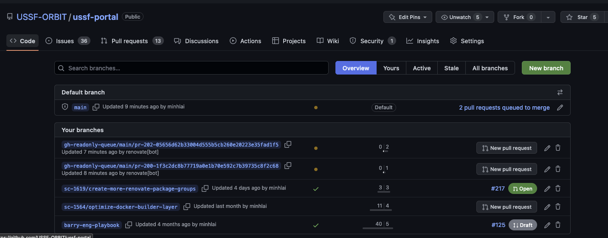
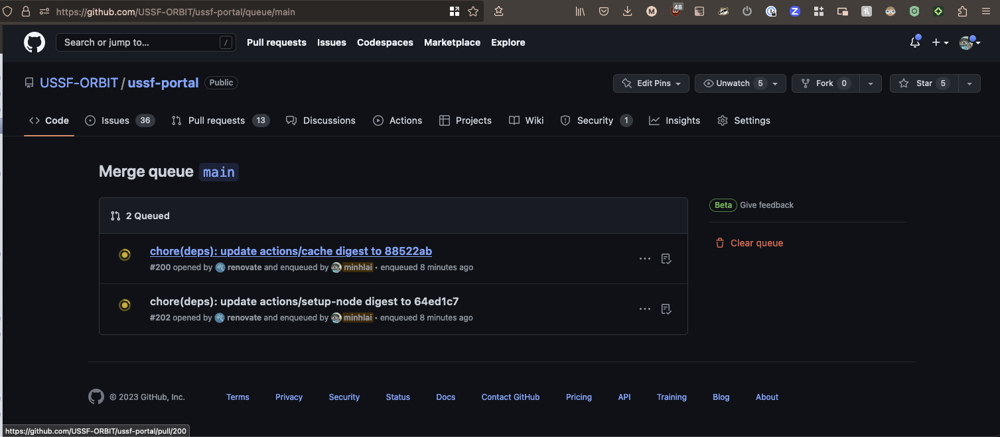
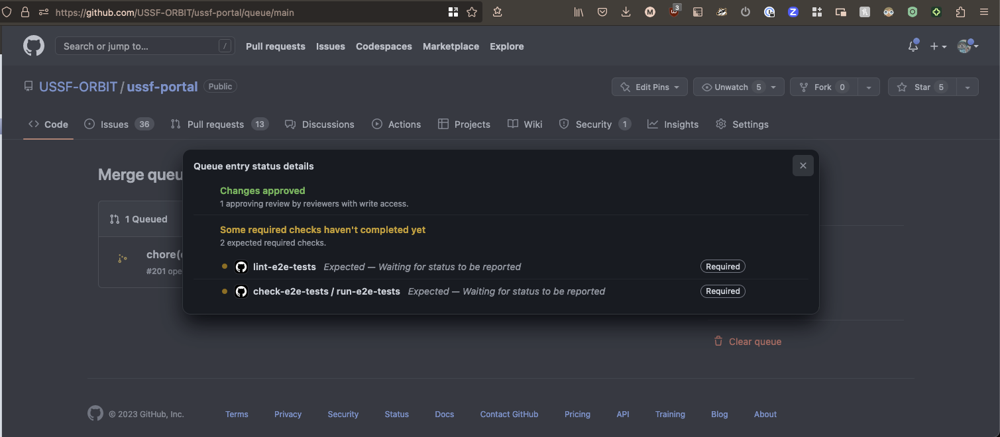
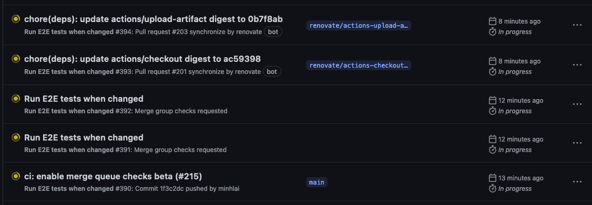

# Merge queue notes:

## When can something be added to the Merge Queue?
A PR has to be manually added to the Merge Queue. Once it is in the Queue, status checks will be run and if passing the PR will be merged.
- You can slate a PR to be added to the Queue by clicking "Merge when Ready" before it is approved. Once approved and passing checks, it is pushed to the Queue
- You can slate a PR to be added to the Queue by clicking "Merge when Ready" before it is passing checks. Once it is passing checks, it is pushed to the Queue.
- You can push something to the Queue by clicking "Merge when Ready" after it has been approved and passed checks. It will automatically be pushed to the Queue.

## How does Merge Queue work?
- Merge Queue makes new temporary branches with the latest changes from the base branch, the changes from other pull requests already in the queue, and the changes from your pull request. That is pushed to the end of the Merge Queue and triggers a workflow event called a [Merge Group](https://docs.github.com/en/actions/using-workflows/events-that-trigger-workflows#merge_group).
- You can see the Merge Queue in `/branches` under `Default branch`. In this repo that page is https://github.com/USSF-ORBIT/ussf-portal/queue/main.
- CI will make sure all required status checks are passing on the Merge Group before the branch is merged. You can see a Queue entry's status details to see what checks are required and the details of the GHA runs. 
- You can see which GHA runs are for the Merge Queue (filter by `Merge Group` event to see only Merge Queue runs). In this repo and for the ` run-e2e-tests.yml` check, that filtered view URL is https://github.com/USSF-ORBIT/ussf-portal/actions/workflows/run-e2e-tests.yml?query=event%3Amerge_group. Unfortunately, it's not as simple to map the GHA run back to the original Merge Group from the Actions view.

- When PRs in Merge Queue pass their checks, they are automatically merged in FIFO order and the temporary branches are deleted.

## Caveats:
- `github.head_ref` is not available in the github context of the temporary Merge Queue branches because it is only available in PRs. `github.ref` refers to the ref of the Merge Group, not the orginal branch. We need an equivalent variable to get the name of the original bramch to checkout the equivalent branches for this PR in other repos during e2e tests. 

Links:

[Merging a pull request with a merge queue](https://docs.github.com/en/pull-requests/collaborating-with-pull-requests/incorporating-changes-from-a-pull-request/merging-a-pull-request-with-a-merge-queue?tool=webui)

[Managing a merge queue](https://docs.github.com/en/repositories/configuring-branches-and-merges-in-your-repository/configuring-pull-request-merges/managing-a-merge-queue)

