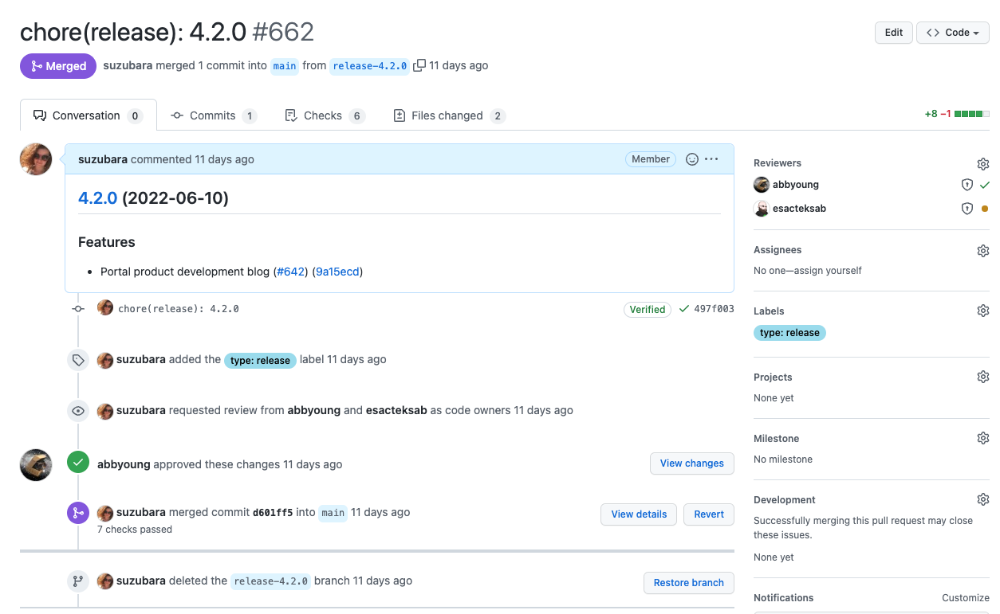
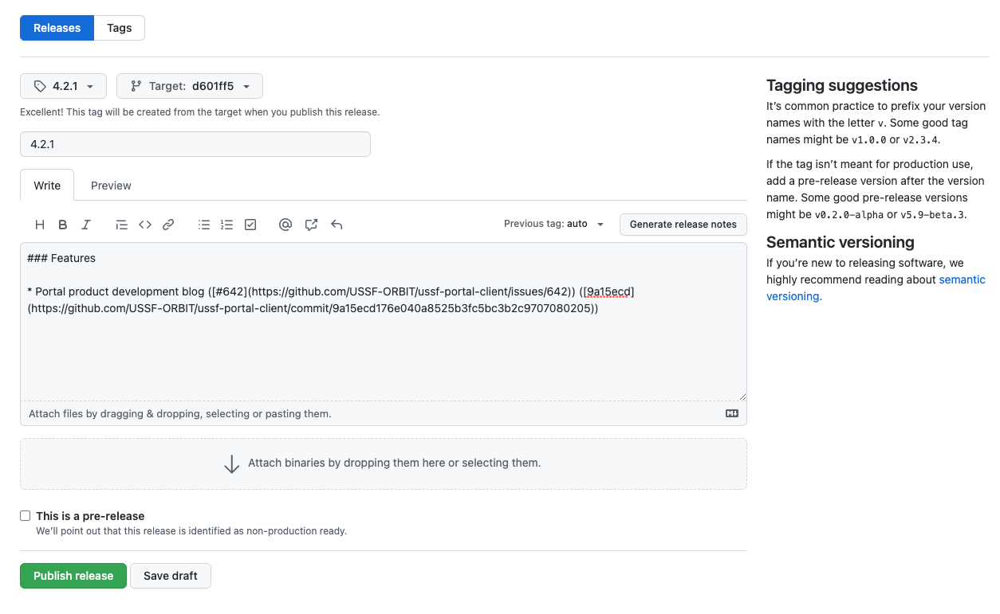
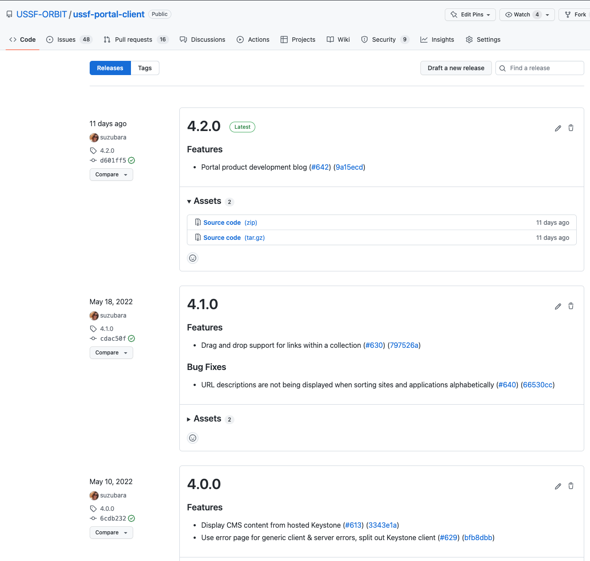
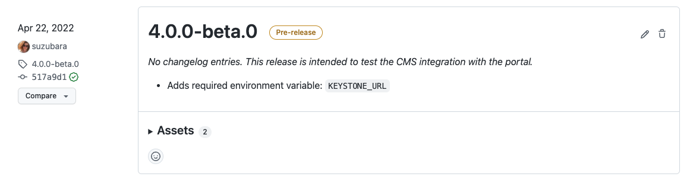

# Releasing

This document describes our process for tagging a release when deploying a new version of our applications, and applies to both the [portal client](https://github.com/USSF-ORBIT/ussf-portal-client) & [CMS](https://github.com/USSF-ORBIT/ussf-portal-cms) applications.

## Why?

Even though our applications are not libraries used by other engineers, they are released to production on a regular basis, and have internal dependencies (i.e., between the portal client and the CMS). Keeping track of what changes correspond to a specific deploy helps us ensure backwards compatibility between applications, and makes it easier to identify when a specific change was made in the eventuality of issues. It also provides artifacts we can use for publishing release notes and tracking the progress of work completed on this project.

## When?

At the time of this writing, our release & deployment workflows are not completely automated. There are definitely some opportunities to further automate the process, described below. Right now we try to strike a balance between deploying frequently but not unnecessarily, which might mean there's a deploy every 1, 2, or even 3 weeks depending on the work in progress. Typically we should strive to deploy when one of the following is true:

- We have a set of dependency updates or completed refactor work that won't result in visible changes to users
- We have completed a feature or enhancement that is ready to be made available to users
- We have a partial feature that is ready to test or validate on production, but that is not yet discoverable or available to users
- We have a completed bug fix or other urgent change that should be released ASAP

It is useful to check on work that has been merged to the `main` branch, as well as current WIP or outstanding PRs on a regular cadence to determine when the next release should be tagged. This is primarily the responsibility of the engineering lead on the project. A new release should be tagged whenever we are ready to deploy an application to production, following the instructions below.

## How?

Both the portal client & CMS have been set up with the following tools & workflows to help facilitate releasing:

### Continuously test on AWS dev

- Whenever a branch is merged to `main`, the application is automatically deployed to our AWS dev environment.
- Ensure any changes, especially database migrations & any architectural or infrastructure changes, have been thoroughly tested on AWS dev.
- It's also a great idea to test the application that wasn't updated against the one that was. For example, if a new change is merged & deployed on the CMS, also login to the portal client on AWS dev and verify that nothing broke (and vice versa).


### Release with release-please

We use the [release-please](https://github.com/googleapis/release-please) github action to automatically create and maintain a release PR. See the [github action documentation](https://github.com/google-github-actions/release-please-action) for details.

1. Find the PR that the `release-please` bot has opened. Example [Client PR](https://github.com/USSF-ORBIT/ussf-portal-client/pull/1039) and example [CMS PR](https://github.com/USSF-ORBIT/ussf-portal-cms/pull/344). This will show you what the proposed next version number and changelog changes, which will show what is included in the release.
   - The PR `release-please` will create should look like this. The only changed files should be `package.json` and `CHANGELOG.md`. Since there are no code changes, approval of this PR should just indicate sign off that we do, in fact, want to deploy the changeset to production.
   

2. Once the PR has been approved and merged, `release-please` will create a release on Github where the tag is the new version number, and the target is the newly merged release commit. Examples of what this looks like are below. If you don't want to wait for `release-please` to do this you can manually create the release, but it doesn't take long.
   
   

3. Trigger the build job to build the final docker image and push it to C1 artifactory. Use the tag that was created by `release-please`.
   - Client [Docker Build Main Push C1 Artifactory](https://github.com/USSF-ORBIT/ussf-portal-client/actions/workflows/build-push-c1-art.yml)
   - CMS [Docker Build Main Push C1 Artifactory](https://github.com/USSF-ORBIT/ussf-portal-cms/actions/workflows/build-push-c1-art.yml)
   - This is a manual step because the `release-please` github action cannot trigger the job.

### Deploy to staging & production

Someone with access to our staging/production infrastructure will need to deploy the image to first the staging environment, where any changes (especially database migrations) should be thoroughly tested, before proceeding to deploy to production. At this point the release is completed!

> It's important to communicate any specific needs to the infra team when deploying, such as if new environment variables need to be added or configured.

### Versioning

We use the [release-please](https://github.com/googleapis/release-please) github action to automatically generate a new version and changelog based on the standard commit messages on the `main` branch. It's a good idea to become familiar with the [conventional commits](https://www.conventionalcommits.org/en/v1.0.0/) standard, and how certain commit types will trigger a patch, minor, or major version. Each application has valid commit types listed in their `release-please` workflow in the file `.github/workflows/release-please.yml`. A major version update will only happen if a commit indicates a breaking change, ie if the commit message includes `!` after the commit type (example: `feat!: ...`). However, you can also explicitly specify a version using a special commit as [described here](https://github.com/googleapis/release-please#how-do-i-change-the-version-number):

> When a commit to the main branch has Release-As: x.x.x (case insensitive) in the commit body, Release Please will open a new pull request for the specified version.

Empty commit example:

```sh
git commit --allow-empty -m "chore: release 2.0.0" -m "Release-As: 2.0.0"
```

```
chore: release 2.0.0

Release-As: 2.0.0
```

Since we should strive for backwards compatibility between the application & CMS as much as possible, major versions are most useful to indicate updates where certain database or infrastructure changes are required that would mean rolling back to a previous version might be more difficult than usual.

We can also make use of the pre-release feature (and corresponding pre-release checkbox when creating a new release on Github) to indicate a release that includes changes that need to be tested on the production environment, before being made in a manner that will affect the end user experience. In this case, we follow the version format: `<new version>-beta.<build number>` where:

- `new version` is what the version will be once the feature has been released for real
- `beta` can be used to indicate the feature is being pre-released as beta - this could also be `alpha` if it's a very early test
- `build number` starts at `0` and is just a way to track pre-release iterations, for example if the first one fails or has issues and another pre-release is needed. This will just increase by one for each version.



#### Example workflow:

- `5.0.0-beta.0` is released to test a feature that will eventually be user-facing, but for now is not discoverable (for example, it can only be accessed by explicitly navigating to `/search`, which only team members are aware of).
- A specific issue with the feature is discovered while the team tests on production, and needs to be released as `5.0.0-beta.1`.
- Once the feature has been fully tested and is ready to be released to users and made discoverable, for example by adding the new page to the existing UI, this change will be released as `5.0.0`.
